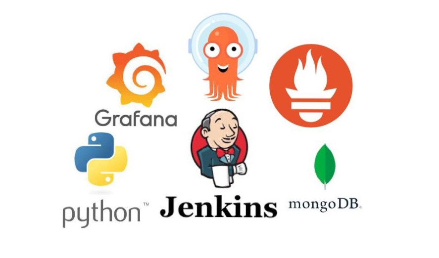
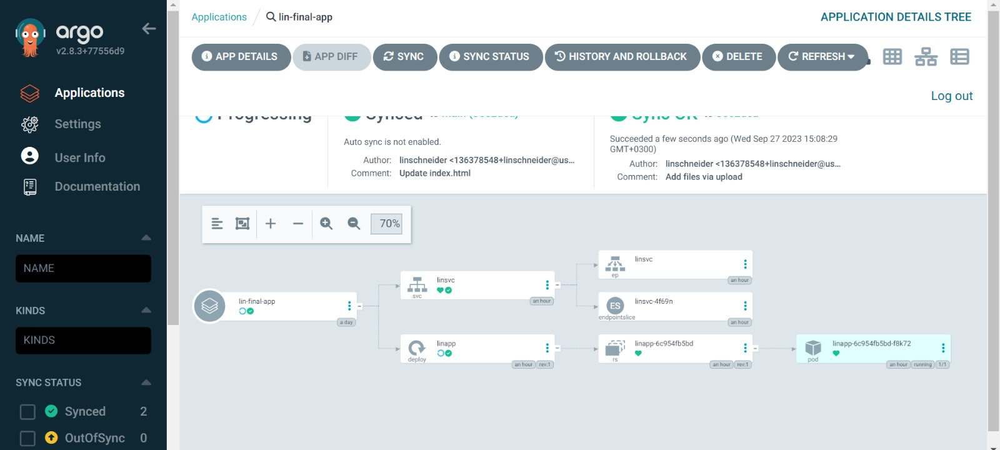
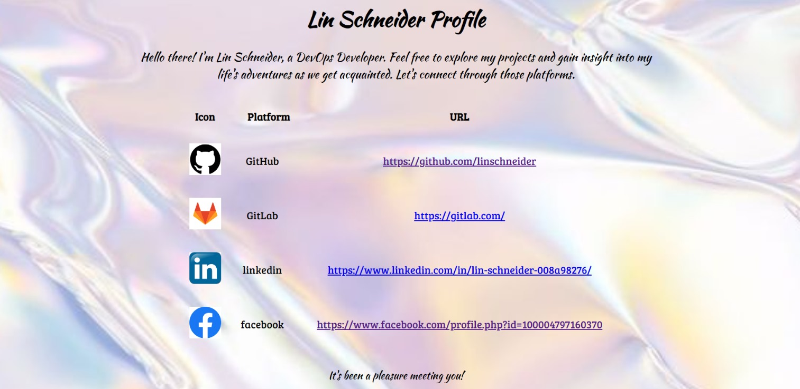

# Welcome to my project

### Flask Application Deployment with Jenkins, ArgoCD, Grafana, and Prometheus

This project demonstrates the deployment and management of a Flask application using Jenkins, ArgoCD, Grafana, and Prometheus. With this setup, you can automate the deployment, monitoring, and observability of the Flask application.

## Prerequisites

Before you begin, ensure you have the following components set up:

- [Jenkins](https://jenkins.io/): A CI/CD tool for automation. You may use the installation instructions for Jenkins from [here](https://github.com/linschneider/finalproject/tree/main/Infrastructures/Jenkins).

- [ArgoCD](https://argoproj.github.io/argo-cd/): A GitOps continuous delivery tool for Kubernetes. You may use the installation instructions for ArgoCD from [here](https://github.com/linschneider/finalproject/tree/main/Infrastructures/ArgoCD).

- [Grafana](https://grafana.com/): An open-source observability and monitoring platform. You may use the installation instructions for Grafana from [here](https://github.com/linschneider/finalproject/tree/main/Infrastructures/Grafana).

- [Prometheus](https://prometheus.io/): An open-source monitoring and alerting toolkit. You may use the installation instructions for Prometheus from [here](https://github.com/linschneider/finalproject/tree/main/Infrastructures/Prometheus).

## Application Deployment Steps

1. **Jenkins CI/CD Pipeline**:
   - Configure a Jenkins pipeline to build and package the Flask application.
   - Create a Jenkinsfile that defines the CI/CD workflow.
   - Trigger the pipeline whenever changes are pushed to your Git repository.
   
   You may see the pipeline's logs in the Jenkinsfile [here]([https://github.com/linschneider/finalproject/blob/main/JenkinsFileLogs]).

2. **ArgoCD Deployment**:
   - Set up ArgoCD to monitor the Git repository where your application manifests are stored.
   - Create an ArgoCD Application resource to deploy and manage your Flask application on a Kubernetes cluster.
   - ArgoCD will ensure the application stays in sync with the desired state defined in your Git repository.
     

3. **Grafana and Prometheus Integration**:
   - Deploy Grafana and Prometheus on your Kubernetes cluster.
   - Configure Prometheus to scrape metrics from your Flask application.
   - Create Grafana dashboards to visualize application metrics and set up alerts.

## Application Structure

- `app.py`: Contains the Flask application code.
- `templates/`: Directory containing HTML templates for the application.

## Customize the Profile Data

You can customize the profile data by modifying the MongoDB collection named `dbapp`. Add or update documents in the collection to display your own profile information.

## Monitoring and Observability

By integrating Grafana and Prometheus, you can gain insights into the performance and health of your Flask application. Use Grafana dashboards to monitor key metrics and set up alerting rules to be notified of any issues.

## Continuous Deployment with ArgoCD

ArgoCD ensures that your Flask application is continuously deployed and stays in sync with the Git repository. Any changes to the application manifests in the repository trigger automatic updates in the cluster.

## Project Architecture

The project follows a modern microservices architecture, leveraging various tools and technologies for each component:

- **Flask Application**: The core of the project is the Flask application (`app.py`) responsible for serving the profile information. It interacts with a MongoDB database to retrieve and display profile data.

- **Jenkins CI/CD**: Jenkins serves as the continuous integration and continuous deployment (CI/CD) tool. It automates the build, testing, and deployment of the Flask application. The Jenkins pipeline defined in the [Jenkinsfile](https://github.com/linschneider/finalproject/blob/main/Jenkinsfile) orchestrates these processes.

- **ArgoCD**: ArgoCD is used for GitOps-based continuous delivery and deployment. It ensures that the deployed application on the Kubernetes cluster stays in sync with the desired state defined in the Git repository. The ArgoCD Application resource manages the Flask application's deployment.

- **Grafana and Prometheus**: Grafana and Prometheus provide monitoring and observability capabilities for the Flask application. Prometheus scrapes metrics from the application, and Grafana is used to create visually informative dashboards to monitor application performance, errors, and more.

- **Kubernetes**: Kubernetes is employed to orchestrate and manage containerized applications, including the Flask application, Grafana, Prometheus, and ArgoCD. It offers scalability, resilience, and ease of management.

This microservices-based architecture allows for scalability, maintainability, and observability of the Flask application while ensuring efficient CI/CD pipelines and robust monitoring capabilities.

## Feel free to explore the project and customize it to suit your needs. If you have any questions or need assistance, please reach out.

